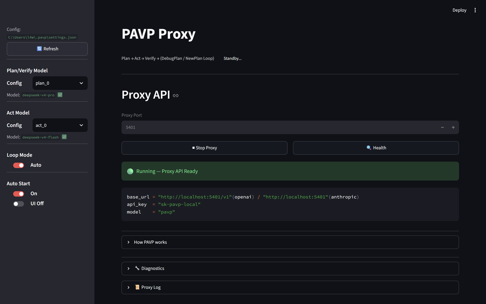

# PAVP — Plan-Act-Verify-Plan

**PAVP** 是一个本地代理框架，通过 LLM 编排（Plan → Act → Verify → Loop）来增强编码 Agent 的能力，同时大幅降低 API 调用成本。

**PAVP** is a local proxy framework that enhances coding agents through LLM orchestration (Plan → Act → Verify → Loop), while significantly reducing API call costs.

---



---

## 项目介绍

### 1. 项目逻辑

PAVP 本质上是一个 **LLM 编排层**，通过本地代理服务实现：

- **Plan**：用高能力模型分析需求，输出结构化计划
- **Act**：用执行模型根据计划生成代码，通过智能体写入文件
- **Verify**：用高能力模型审计代码改动，输出 PASS / SHIP-WITH-FIXES / DO-NOT-SHIP（含 DebugPlan）/ INCOMPLETE（含 NewPlan）/ NEEDS-REVIEW
- **Loop**：失败时自动或手动循环，直到通过或达到最大迭代次数

每个新任务会生成唯一 `task_key`（如 `TK-a1b2c3d4`），Plan 模型输出到 JSON 中，用于跨轮次锚定上下文、缓存隔离和状态追踪。

架构说明：

- **Proxy 模式**：运行本地代理服务，Agent 直接通过 OpenAI 兼容接口调用，PAVP 在后台透明完成 Plan → Act
- **多模型支持**：适配 OpenAI、Anthropic 端口，通过 settings.json 灵活配置 Plan/Act/Verify 使用不同模型

### 2. 环境要求

> **⚠ 仅支持 Windows，未兼容 Linux / macOS**

原因：项目使用了 Windows 注册表自动启动、`ctypes.windll` 进程管理、PowerShell 启动脚本等 Windows 特有功能。

### 3. 使用方式

本质上相当于**换了一个 API 端点**，完美匹配现有 Agent 工作流：

1. **运行启动脚本**：双击或运行 `run.ps1`，自动检查 Python 环境（python 版本、依赖包）并安装缺失项，然后打开 Streamlit 控制面板
2. **填写配置**：编辑 `~/.pavp/settings.json`，填入 plan_model / plan_api / plan_base_url 和 act_model / act_api / act_base_url（运行 `run.ps1` 时自动生成模板）
3. **启动代理**：在 UI 中点击 "Start Proxy"，或直接运行 `python -m pavp.proxy_server`
4. **挂载到 Agent**：将 Agent 的 API 地址改为 `http://localhost:XXXX/v1`，API Key 改为 `sk-pavp-local`，模型名改为 `pavp`，根据UI界面展示的端口号调整（默认端口号为 `5401`）

```python
# Agent 配置示例
base_url = "http://localhost:5401/v1"
api_key  = "sk-pavp-local"
model    = "pavp"
```

### 4. 关闭进程

- **推荐方式**：在 Streamlit UI 中点击 "Stop Proxy"
- **彻底关闭**：打开任务管理器，手动中止所有 python.exe 进程（或终止 `pavp.proxy_server` 相关进程）

### 5. 作者使用情况

- 当前在 **Trae** \ **Claude** 中使用，未测试其他 Agent
- Plan 额度消费至少降低了 **80%+**（使用廉价模型执行 Act，高能力模型仅用于 Plan/Verify）
- <span style="color: #c0392b;">建议用于复杂任务、长任务</span>，简单任务会过度思考
- 大体可用，比直接使用普通模型要强

### 6. 自举

PAVP 可以自举——拉取源码后，用当前生产环境的 PAVP 来优化 PAVP 自身的代码。

> 效果并不理想，但作者确实在这样做。

### 7. 优势

PAVP 从 Agent 视角看只是一个模型端点（`model="pavp"`），本质上是**单 Agent 架构**：

- **相比多 Agent 协同**：避免了智能体之间交流产生的 token 消耗、注意力漂移和标记能力损耗（虽仍有少量损耗，但远低于多 Agent 方案）
- **相比单 Agent + 顶级模型**：任务解决能力上无优势，但**省钱优势极大**——用廉价模型执行实际编码，高能力模型仅做规划和审查

---

## Project Introduction

### 1. Architecture

PAVP is essentially an **LLM orchestration layer** implemented as a local proxy:

- **Plan**: A high-capability model analyzes requirements and outputs a structured plan
- **Act**: An execution model generates code following the plan, written to files via the agent
- **Verify**: The high-capability model audits the code changes, outputting PASS / SHIP-WITH-FIXES / DO-NOT-SHIP (with DebugPlan) / INCOMPLETE (with NewPlan) / NEEDS-REVIEW
- **Loop**: On failure, loops automatically or manually until passing or reaching max iterations

Each new task generates a unique `task_key` (e.g. `TK-a1b2c3d4`) in the Plan JSON, used for cross-turn context anchoring, cache isolation, and state tracking.

Architecture notes:

- **Proxy Mode**: Runs a local proxy server; the agent calls it via an OpenAI-compatible API, and PAVP transparently handles Plan → Act in the background
- **Multi-model support**: Compatible with OpenAI and Anthropic endpoints; configure different models for Plan/Act/Verify roles via settings.json

### 2. Environment

> **⚠ Windows only. Linux / macOS are NOT supported.**

The project uses Windows-specific features: Registry auto-start, `ctypes.windll` for process management, PowerShell launcher scripts, etc.

### 3. How to Use

Essentially, you just **swap the API endpoint** — it fits perfectly into your existing agent workflow:

1. **Run launcher**: Run `run.ps1` — it auto-checks the Python environment (python version, dependencies) and installs missing packages, then opens the Streamlit control panel
2. **Configure**: Edit `~/.pavp/settings.json` — fill in plan_model / plan_api / plan_base_url and act_model / act_api / act_base_url (run `run.ps1` to auto-generate a template)
3. **Start proxy**: Click "Start Proxy" in the UI, or run `python -m pavp.proxy_server` directly
4. **Mount to agent**: Point your agent to `http://localhost:XXXX/v1` with API key `sk-pavp-local` and model `pavp` — adjust the port based on the UI display (default port is `5401`)

```python
# Agent configuration example
base_url = "http://localhost:5401/v1"
api_key  = "sk-pavp-local"
model    = "pavp"
```

### 4. Stopping the Process

- **Recommended**: Click "Stop Proxy" in the Streamlit UI
- **Force kill**: Open Task Manager and manually terminate all python.exe processes (or kill those related to `pavp.proxy_server`)

### 5. Author's Usage

- Currently used **Trae** \ **Claude**; not tested with other agents
- Plan token consumption reduced by **80%+** (cheap model for Act, capable model only for Plan/Verify)
- <span style="color: #c0392b;">Recommended for complex/long tasks</span>; simple tasks may cause overthinking
- Generally usable and better than using a raw cheap model directly

### 6. Bootstrapping

PAVP is self-bootstrapping — pull the source code and use the production PAVP to optimize PAVP's own code.

> The results are not great, but the author does it anyway.

### 7. Advantage

From the agent's perspective, PAVP is just a single model endpoint (`model="pavp"`) — it's a **single-agent architecture**:

- **vs. Multi-Agent**: Avoids token waste, attention drift, and marking capability loss caused by inter-agent communication (some loss remains, but far less than multi-agent setups)
- **vs. Single Agent + Top-Tier Model**: No advantage in task-solving capability, but **massive cost savings** — cheap models do the actual coding, while capable models only handle planning and review

---

## 项目结构

```
PAVP/
├── pavp/
│   ├── __init__.py          # 包初始化，版本号
│   ├── proxy_server.py      # FastAPI 代理（Plan → Act）
│   ├── orchestrator.py      # 状态机（Plan → Act → Verify → Loop）
│   ├── engine.py            # LLM 调用工具
│   ├── act_executor.py      # 智能体 子进程执行器
│   ├── prompts.py           # 各阶段提示词模板
│   ├── models.py            # Pydantic 数据模型
│   ├── settings.py          # 设置加载器（~/.pavp/settings.json）
│   ├── ui.py                # Streamlit 控制面板
│   └── auto_start.py        # Windows 注册表自启动
├── run.ps1                  # PowerShell 启动脚本
├── requirements.txt
└── README.md
```

## Project Structure

```
PAVP/
├── pavp/
│   ├── __init__.py          # Package init, version
│   ├── proxy_server.py      # FastAPI proxy (Plan → Act)
│   ├── orchestrator.py      # State machine (Plan → Act → Verify → Loop)
│   ├── engine.py            # LLM calling utilities
│   ├── act_executor.py      # Agent subprocess executor
│   ├── prompts.py           # Prompt templates for all phases
│   ├── models.py            # Pydantic data models
│   ├── settings.py          # Settings loader (~/.pavp/settings.json)
│   ├── ui.py                # Streamlit control panel
│   └── auto_start.py        # Windows Registry auto-start
├── run.ps1                  # PowerShell launcher
├── requirements.txt
└── README.md
```

## License

Apache 2.0


