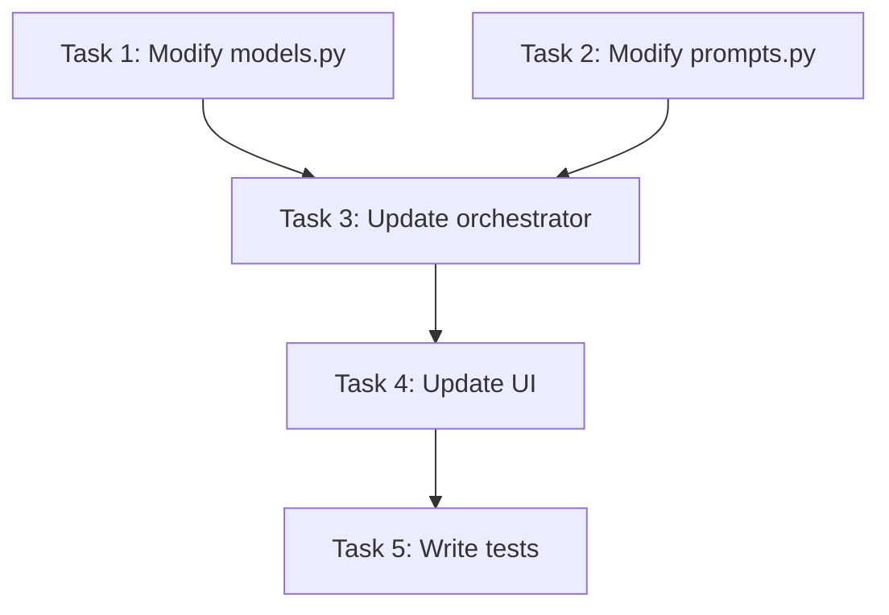

# Implementation Plan Writing Skill (Writing Plans)

This skill originates from the Superpowers methodology, adapted for the PAVP project (Python + Streamlit + LiteLLM + Claude Code). Core principle: **each task should be completable in 2-5 minutes, with precise file paths, complete code, and verification steps**.

---

## Workflow Overview

```
User raises requirement
      |
[Step 1] Requirements Analysis
  +-- Confirm goal (what? why?)
  +-- Identify scope boundaries
  +-- List non-doable items (YAGNI)
      |
[Step 2] Task Decomposition
  +-- Each task independently executable
  +-- Each task 2-5 minutes to complete
  +-- Dependencies between tasks are explicit
      |
[Step 3] Output Plan Document
  +-- Task number + title
  +-- Involved files (precise paths)
  +-- Specific operation description
  +-- Key code examples
  +-- Verification steps
```

---

## Step 1: Requirements Analysis

### 1.1 Requirements Confirmation Template

Confirm with the user before writing the plan:

```markdown
## Requirements Confirmation

### Goal
- {One-sentence description of the goal}

### Scope
- Includes: {things to do}
- Excludes: {things NOT to do (YAGNI)}

### Constraints
- {Technical constraints, compatibility constraints, security constraints}

### Acceptance Criteria
1. {Verifiable criterion 1}
2. {Verifiable criterion 2}
3. {Verifiable criterion 3}
```

### 1.2 YAGNI Checklist

Evaluate each potential feature using YAGNI:

```
[ ] Does the current requirement clearly need this feature?
[ ] Will this be needed in the future? (If yes -> YAGNI, don't do it)
[ ] Can it be added when actually needed? (If yes -> YAGNI, don't do it)
[ ] Would omitting it block the current task? (If no -> YAGNI, don't do it)
```

---

## Step 2: Task Decomposition

### 2.1 Task Granularity Standards

| Standard | Description |
|---|---|
| **Duration** | Each task 2-5 minutes |
| **Independence** | Can be completed independently, no dependency on unfinished tasks |
| **Verifiable** | Clear verification steps after completion |
| **Single Responsibility** | One task does one thing |

### 2.2 Task Template

```markdown
### Task {N}: {Short title}

**File:** `{relative path}/{filename}`

**Operation:** {One-sentence description}

**Code:**
```{language}
{Key code snippet}
```

**Verification:**
- [ ] {Verification step 1}
- [ ] {Verification step 2}
```

### 2.3 Task Dependency Diagram



---

## Step 3: Plan Document Example

### Example: Add "Session Export as Markdown" to PAVP

```markdown
## Implementation Plan: Session Export as Markdown

### Requirements Confirmation
- Goal: Export PAVP session history as Markdown files
- Includes: export method, CLI command, UI button
- Excludes: PDF export, HTML export (YAGNI)
- Constraints: compatible with Python 3.10+, no new dependencies

### Task 1: Add Markdown export helper method

**File:** `pavp/export.py` (new)

**Operation:** Create export module, implement session state to Markdown conversion

**Code:**
```python
from __future__ import annotations

from .models import SessionState


def session_to_markdown(state: SessionState) -> str:
    """Convert session state to Markdown string."""
    lines = [
        f"# PAVP Session {state.session_id}",
        f"",
        f"**Original Requirement:** {state.original_requirement}",
        f"**Status:** {state.fsm_state}",
        f"**Iterations:** {state.iteration}/{state.max_iterations}",
        f"",
    ]
    for i, plan in enumerate(state.plan_history, 1):
        tag = "DebugPlan" if plan.is_debug_plan else "Plan"
        lines.append(f"## {tag} #{i} [{plan.plan_id}]")
        lines.append(f"Summary: {plan.summary}")
        if plan.root_cause:
            lines.append(f"Root cause: {plan.root_cause}")
        for t in plan.tasks:
            lines.append(f"- [{t.id}] {t.title} ({t.status})")
        lines.append("")
    for i, act in enumerate(state.act_history, 1):
        lines.append(f"## Act #{i}")
        lines.append(f"- Success: {act.success}")
        lines.append(f"- Files changed: {', '.join(act.files_changed) or '(none)'}")
        lines.append(f"- Cost: ${act.cost_usd:.4f}")
        lines.append("")
    for i, v in enumerate(state.verify_history, 1):
        lines.append(f"## Verify #{i}")
        lines.append(f"Verdict: {v.verdict.value}")
        lines.append(f"Summary: {v.summary}")
        for issue in v.issues:
            lines.append(f"- [{issue.severity}] {issue.file}:{issue.line} - {issue.failure_scenario}")
        lines.append("")
    return "\n".join(lines)
```

**Verification:**
- [ ] File created at `pavp/export.py`
- [ ] `python -c "from pavp.export import session_to_markdown"` runs without error

---

### Task 3: Add export button to UI

**File:** `pavp/ui.py`

**Operation:** Add session export panel below proxy control area

**Code:**
```python
st.divider()
st.header("Session Export")
export_sid = st.text_input("Session ID", key="export_sid")
if st.button("Export to Markdown", disabled=not export_sid):
    from .export import session_to_markdown
    from . import storage as pavp_storage
    state = pavp_storage.load(export_sid)
    if state:
        md = session_to_markdown(state)
        st.download_button(
            "Download Markdown",
            data=md.encode("utf-8"),
            file_name=f"pavp_session_{export_sid}.md",
            mime="text/markdown",
        )
    else:
        st.error(f"Session {export_sid} does not exist")
```

**Verification:**
- [ ] Streamlit UI displays export panel
- [ ] Valid session ID triggers download of Markdown file
- [ ] Invalid session ID shows error message
```

---

## Project-Specific Task Patterns

### Adding a New Pydantic Model

```markdown
### Task: Add {ModelName} to models.py

**File:** `pavp/models.py`

**Operation:** Add new Pydantic BaseModel

**Code:**
```python
class {ModelName}(BaseModel):
    """{Model description}"""
    field1: str
    field2: list[str] = []
    optional_field: Optional[str] = None
```

**Verification:**
- [ ] `python -c "from pavp.models import {ModelName}"` runs without error
- [ ] Model correctly supports `model_dump()` and `model_validate()`
```

### Adding a New Prompt Template

```markdown
### Task: Add {Phase} prompt to prompts.py

**File:** `pavp/prompts.py`

**Operation:** Add system prompt constant and user prompt builder function

**Code:**
```python
{STAGE}_SYSTEM = """You are ..."""

def build_{stage}_user_prompt(...) -> str:
    return f"""..."""
```

**Verification:**
- [ ] `python -c "from pavp.prompts import {STAGE}_SYSTEM"` runs without error
- [ ] Prompt content conforms to JSON schema output requirements
- [ ] Consistent with existing prompt style
```

### Adding a New Streamlit UI Component

```markdown
### Task: Add {component name} in ui.py

**File:** `pavp/ui.py`

**Operation:** Add new UI section

**Key checks:**
- [ ] Component does not conflict with existing sections
- [ ] session_state initialized before component usage
- [ ] Button operations provide clear visual feedback
- [ ] `streamlit run pavp/ui.py` runs without error
```

### Modifying LiteLLM Configuration

```markdown
### Task: Modify LiteLLM proxy config

**File:** `litellm.config.yaml`

**Operation:** Add/modify model config

**Key checks:**
- [ ] YAML syntax correct
- [ ] New models use `os.environ/` environment variable references
- [ ] `start_proxy.ps1` starts normally
```

### Adding a New Python Dependency

```markdown
### Task: Add {package name} dependency

**File:** `requirements.txt`

**Operation:** Add package reference

**Key checks:**
- [ ] Package version compatible with Python 3.10+
- [ ] `pip install -r requirements.txt` succeeds
- [ ] No conflicts with existing dependencies (httpx, pydantic, pyyaml, litellm, streamlit)
```

---

## Plan Document Review Checklist

Before outputting a plan document, self-check with this list:

```
[ ] Each task 2-5 minutes to complete?
[ ] Each task has precise file paths?
[ ] Each task includes key code examples?
[ ] Each task has verification steps?
[ ] Dependencies between tasks are explicit?
[ ] YAGNI exclusions included?
[ ] Acceptance criteria included?
[ ] Error handling considered?
[ ] Code examples follow PAVP coding conventions?
  [ ] from __future__ import annotations
  [ ] Type annotations: str | None instead of Optional[str]
  [ ] Pydantic v2 syntax (model_dump / model_validate)
  [ ] Comments in English
```

---

## Code Comment Conventions

### Core Principles

**Add comments appropriately, not line-by-line.** The goal of comments is to help developers unfamiliar with the code quickly understand "what this code does and why it does it this way."

### Scenarios Where Comments Are Required

| Scenario | Comment Content | Example |
|---|---|---|
| **Module level** | File header docstring explaining responsibility | `"""PAVP Act Executor - calls Claude Code headless subprocess for coding"""` |
| **Public functions/classes** | Docstring briefly describing responsibility | `"""Call CC headless to execute Act phase."""` |
| **Non-intuitive algorithms** | Explain core idea (1-2 lines) | `# Mixed-base iteration: 8x5x3 = 120 parameter combinations` |
| **Security constraints** | Explain the reason for restriction | `# Disallowed tools in Act phase` |
| **Env variable mapping** | Explain source and purpose | `# settings.json fields -> LiteLLM environment variable names` |
| **Error tolerance** | Explain why catch + pass | `# Event callback failures don't block main flow` |

### Scenarios Where Comments Are NOT Needed

- Self-explanatory code (e.g., `if token is None: return`)
- Already covered by docstring parameters/return values
- Textbook operations (e.g., `for item in items:`)
- Intent clearly expressed by function name

### Comment Language

- All comments must be in English
- Technical terms remain in English (e.g., `Pydantic`, `LiteLLM`, `FastAPI`, `Streamlit`)

---

## Code Refactoring Conventions

### Mandatory Clause: Do NOT Delete Existing Comments During Refactoring

**Rule:** When performing any refactoring operation (function extraction, variable rename, code relocation, logic-equivalent replacement), **do NOT delete existing comments in the source code**. This includes but is not limited to:

- Inline comments (`# ...`)
- Algorithm logic explanations (`# Calculation logic: ...`)
- Step number comments (`# Step 1: Plan phase`)
- Parameter purpose comments (`# Budget ceiling (USD)`)
- TODO / FIXME / HACK markers

**Process:**

1. In `SearchReplace` operations, both `old_str` and `new_str` must include the same original comments
2. If refactoring causes comment semantics to mismatch code, **update the comment content first before committing**, do not delete directly
3. When extracting pure functions from instance methods, all inline comments must be carried over
4. In Code Review, check refactoring diffs - any unjustified deletion of comments is a **fail** item

**Review Rejection Criteria:**

| Violation | Severity | Action |
|---|---|---|
| Refactoring diff deletes algorithm step comments without replacement | High | **Reject merge**, require supplement and resubmit |
| Deletes parameter explanation comments without replacement | High | **Reject merge** |
| Pure function extraction misses inline comments from original function | Warning | Require completion before approval |
| Comments updated to match refactored code semantics | Allow | Normal pass |
